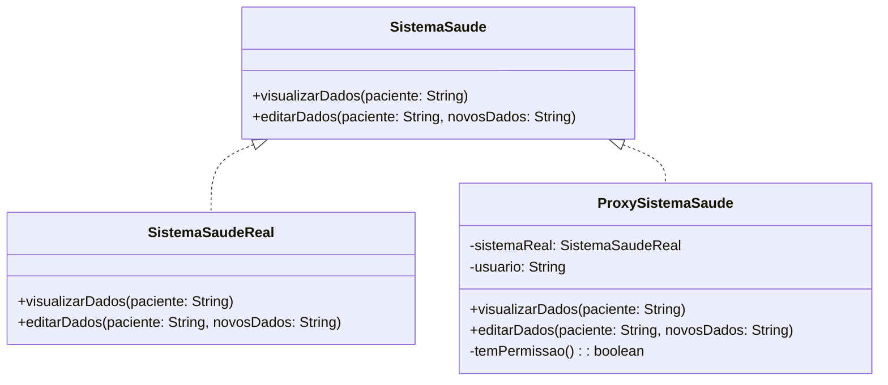

# Padrão Proxy

## Intenção
O padrão Proxy fornece um substituto ou representante de um objeto para controlar o acesso a ele. O Proxy atua como um intermediário entre o cliente e o objeto real, permitindo que o cliente interaja com o objeto sem precisar conhecer sua implementação interna.

## Também conhecido como
Surrogate

## Motivação
Em sistemas que gerenciam dados sensíveis, como informações de saúde, o acesso deve ser controlado para garantir a privacidade. O padrão Proxy atua como intermediário, verificando permissões antes de permitir o acesso aos dados. Além disso, ele pode implementar caching para otimizar o desempenho, garantindo que apenas usuários autorizados acessem informações críticas.

## Exemplo Aplicado


## Estrutura GOF


## Participantes:
### Subject (SistemaSaude)
- Define a interface comum para `RealSubject` (SistemaSaudeReal) e `Proxy` (ProxySistemaSaude).
- Permite que o Proxy seja usado no lugar do RealSubject.
### RealSubject (SistemaSaudeReal)
- Implementa a lógica real de acesso e manipulação dos dados de saúde.
- Só é criado quando necessário (Lazy Loading).
### Proxy (ProxySistemaSaude)
- Controla o acesso ao `RealSubject`.
- Verifica permissões antes de permitir o acesso.
- Adia a criação do `RealSubject` até que seja realmente necessário.
### Cliente (ExemploProxySaude)    
- Interage com o Proxy sem saber da existência do `RealSubject`.
- Testa o comportamento do Proxy com diferentes usuários.

## Exemplo do Código
```java
interface SistemaSaude {
    void visualizarDados(String paciente);
    void editarDados(String paciente, String novosDados);
}

class SistemaSaudeReal implements SistemaSaude {
    @Override
    public void visualizarDados(String paciente) {
        System.out.println("Visualizando dados do paciente: " + paciente);
    }

    @Override
    public void editarDados(String paciente, String novosDados) {
        System.out.println("Editando dados do paciente: " + paciente + " com novos dados: " + novosDados);
    }
}

class ProxySistemaSaude implements SistemaSaude {
    private SistemaSaudeReal sistemaReal;
    private String usuario;

    public ProxySistemaSaude(String usuario) {
        this.usuario = usuario;
        this.sistemaReal = new SistemaSaudeReal();
    }

    @Override
    public void visualizarDados(String paciente) {
        if (temPermissao()) {
            sistemaReal.visualizarDados(paciente);
        } else {
            System.out.println("Acesso negado. Você não tem permissão para visualizar os dados do paciente.");
        }
    }

    @Override
    public void editarDados(String paciente, String novosDados) {
        if (temPermissao()) {
            sistemaReal.editarDados(paciente, novosDados);
        } else {
            System.out.println("Acesso negado. Você não tem permissão para editar os dados do paciente.");
        }
    }

    private boolean temPermissao() {
        return "MEDICO".equals(usuario) || "ENFERMEIRO".equals(usuario);
    }
}

public class ExemploProxySaude {
    public static void main(String[] args) {
        SistemaSaude sistemaMedico = new ProxySistemaSaude("MEDICO");
        SistemaSaude sistemaEnfermeiro = new ProxySistemaSaude("ENFERMEIRO");
        SistemaSaude sistemaUsuarioComum = new ProxySistemaSaude("USUARIO");

        sistemaMedico.visualizarDados("Pedro Silva");

        sistemaEnfermeiro.editarDados("Pedro Silva", "Alergia a dipirona");

        sistemaUsuarioComum.visualizarDados("Pedro Silva");

        sistemaUsuarioComum.editarDados("Pedro Silva", "Novo endereço: Rua 123");
    }
}
```
## Implementação:
1. **Definir a Interface do Sistema de Saúde:** Crie a interface que declara as operações essenciais para visualizar e editar dados de pacientes.
2. **Implementar a Classe Real:** Utilize a classe SistemaSaudeReal para fornecer as implementações concretas das operações de visualização e edição de dados.
3. **Criar o Proxy:** Desenvolva a classe ProxySistemaSaude que controla o acesso ao SistemaSaudeReal, verificando as permissões do usuário antes de permitir operações.
4. **Construir o Cliente:** No método main da classe ExemploProxySaude, crie instâncias do proxy para diferentes tipos de usuários e teste as operações de visualização e edição de dados.

## Aplicabilidade
O padrão Proxy é aplicável em várias situações, incluindo:

## 1. Proxy Remoto
Este tipo de Proxy é utilizado quando um objeto está em um espaço de endereçamento diferente, como um servidor remoto. Ele atua como um intermediário, permitindo que o cliente interaja com o objeto como se estivesse localmente.
### Código
```java
interface ServicoRemoto {
    String obterDados();
}

class ServicoRemotoReal implements ServicoRemoto {
    @Override
    public String obterDados() {
        return "Dados do serviço remoto.";
    }
}

class ProxyRemoto implements ServicoRemoto {
    private ServicoRemotoReal servicoReal;

    @Override
    public String obterDados() {
        if (servicoReal == null) {
            servicoReal = new ServicoRemotoReal();
        }
        return servicoReal.obterDados();
    }
}

public class ExemploProxyRemoto {
    public static void main(String[] args) {
        ServicoRemoto servico = new ProxyRemoto();
        System.out.println(servico.obterDados());
    }
}

```
## 2. Proxy Virtual
Este Proxy é usado para criar objetos pesados sob demanda, economizando recursos ao evitar a criação de instâncias até que sejam realmente necessárias.
### Código
```java
interface Imagem {
    void exibir();
}

class ImagemReal implements Imagem {
    private String nome;

    public ImagemReal(String nome) {
        this.nome = nome;
        carregarImagem();
    }

    private void carregarImagem() {
        System.out.println("Carregando a imagem: " + nome);
    }


    @Override
    public void exibir() {
        System.out.println("Exibindo a imagem: " + nome);
    }
}

class ProxyImagem implements Imagem {
    private ImagemReal imagemReal;
    private String nome;

    public ProxyImagem(String nome) {
        this.nome = nome;
    }


    @Override
    public void exibir() {
        if (imagemReal == null) {
            imagemReal = new ImagemReal(nome);
        }
        imagemReal.exibir();
    }
}

public class ExemploProxyVirtual {
    public static void main(String[] args) {
        Imagem imagem = new ProxyImagem("foto.jpg");
        imagem.exibir(); // Carrega e exibe a imagem
        imagem.exibir(); // Apenas exibe a imagem, sem recarregar
    }
}
```
## 3. Proxy de Proteção
Este Proxy é projetado para controlar o acesso a um objeto, garantindo que apenas usuários autorizados possam interagir com ele. É especialmente útil em sistemas que lidam com informações sensíveis.
### Código
```java
public interface ContaBancaria {
    void verSaldo();
}

public class ContaBancariaReal implements ContaBancaria{
    private String titular;  
    private double saldo;

    public ContaBancariaReal(String titular, double saldo) {
        this.titular = titular;
        this.saldo = saldo;
    }

    @Override
    public void verSaldo() {
        System.out.printf("Exibindo saldo da conta de %s: R$ %.2f%n", titular, saldo);;
    }
}

public class ProxySeguranca implements ContaBancaria{
    private ContaBancaria contaReal;
    private String papelUsuario;

    public ProxySeguranca(String titular, double saldo, String papelUsuario) {
        this.contaReal = new ContaBancariaReal(titular, saldo);
        this.papelUsuario = papelUsuario;
    }

    @Override
    public void verSaldo() {
        if ("ADMIN".equals(papelUsuario)) {
            contaReal.verSaldo();
        }
        else {
            System.out.println("Acesso negado. Você não tem permissão.");
        }
    }
}

public class ExemploProxy {
    public static void main(String[] args) {
        ContaBancaria usuarioComum = new ProxySeguranca("Pedro", 700.00, "USUARIO");
        usuarioComum.verSaldo();

        ContaBancaria admin = new ProxySeguranca("Joana", 2000.00,"ADMIN");
        admin.verSaldo();
    }
}

```

## 4. Smart Reference (Referência Inteligente)
Este Proxy é utilizado para gerenciar referências a objetos, permitindo que ações adicionais sejam executadas ao acessar um objeto, como contar referências ou carregar objetos persistentes.
### Código
``` java
class ObjetoPersistente {
    public void carregar() {
        System.out.println("Objeto persistente carregado.");
    }
}

class SmartReference {
    private ObjetoPersistente objeto;
    private int contagemReferencias;

    public void acessar() {
        if (objeto == null) {
            objeto = new ObjetoPersistente();
            objeto.carregar();
        }
        contagemReferencias++;
        System.out.println("Referência acessada. Total de referências: " + contagemReferencias);
    }

    public void liberar() {
        contagemReferencias--;
        if (contagemReferencias <= 0) {
            objeto = null;
            System.out.println("Objeto liberado da memória.");
        }
    }
}
public class ExemploSmartReference {
    public static void main(String[] args) {
        SmartReference referencia = new SmartReference();
        referencia.acessar();
        referencia.acessar();
        referencia.liberar();
        referencia.liberar();
    }
}
```

## Colaborações:
- Dependendo de sua categoria, o Proxy retransmite pedidos ao RealSubject quando adequado.

## Consequências:
### Benefícios
1. **Acesso Indireto:** O padrão Proxy permite que os desenvolvedores ocultem a complexidade do acesso a objetos. Isso facilita a interação com objetos que podem estar em locais diferentes, tornando o sistema mais intuitivo.

2. **Otimização de Recursos:** Com proxies virtuais, é possível criar objetos apenas quando realmente necessários. Isso não só economiza memória, mas também melhora a eficiência do sistema, evitando a criação de objetos que podem nunca ser utilizados.

3. **Controle de Acesso:** Proxies de proteção garante que apenas usuários autorizados possam acessar informações sensíveis. Isso é especialmente importante em sistemas onde a privacidade é fundamental.

4. **Copy-on-Write:** Essa técnica permite que objetos grandes sejam copiados apenas quando necessário. Isso reduz o custo computacional, especialmente em situações onde as cópias não são frequentemente modificadas.

### Desvantagens
1. **Complexidade Adicional:** A introdução de proxies pode aumentar a complexidade do sistema. Embora isso possa ser benéfico em alguns casos, também pode dificultar a manutenção e a compreensão do código.
   
2. **Gerenciamento de Estado:** Proxies que gerenciam contagens de referências podem complicar o estado do sistema, especialmente em ambientes multithread, onde a concorrência pode levar a problemas inesperados.

3. **Custo de Cópia:** Embora a técnica copy-on-write seja eficiente, se um objeto for frequentemente modificado, o custo de cópias repetidas pode se acumular, tornando essa abordagem menos vantajosa.

## Usos conhecidos:
**- NEXTSTEP:** Utiliza proxies, conhecidos como NXProxy, como representantes locais de objetos distribuídos. Quando um cliente solicita um objeto remoto, o servidor cria um proxy que codifica e encaminha mensagens para o objeto remoto, retornando os resultados de forma semelhante.

**- Smalltalk:** McCullough discute a aplicação de proxies para acessar objetos remotos.

**- Encapsuladores:** Pascoe explora como "encapsulators" podem ser usados para controlar efeitos colaterais em chamadas de métodos e gerenciar o acesso a recursos.

## Padrões relacionados:
**- Adapter:** Um adaptador oferece uma interface diferente para um objeto, enquanto um proxy mantém a mesma interface. Um proxy que controla o acesso pode recusar operações, fazendo com que sua interface seja um subconjunto da do objeto.

**- Decorator:** Embora decoradores e proxies possam parecer semelhantes, eles têm funções diferentes. Decoradores adicionam novas funcionalidades a um objeto, enquanto proxies controlam o acesso a ele.

## Conclusão
O padrão Proxy é uma ferramenta que oferece flexibilidade e controle em sistemas de software. Ao permitir que um objeto atue como um substituto para outro, ele facilita o gerenciamento de acesso, otimiza o uso de recursos e promove um design modular. Com suas diversas aplicações, desde Proxies Remotos até Proxies de Proteção e Referências Inteligentes. 

## Referências
GAMMA, Erich; HELM, Richard; JOHNSON, Ralph; VLISSIDES, John. Padrões de projeto: soluções reutilizáveis de software orientado a objetos. 1. ed. Porto Alegre: Bookman, 2000.

